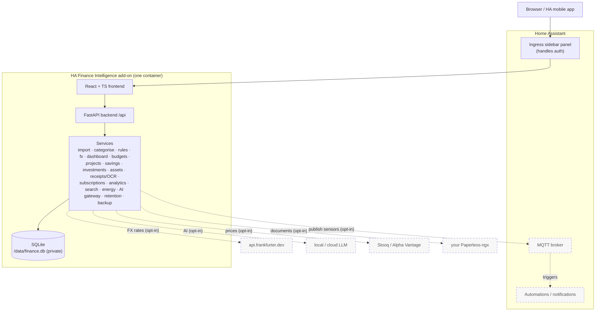
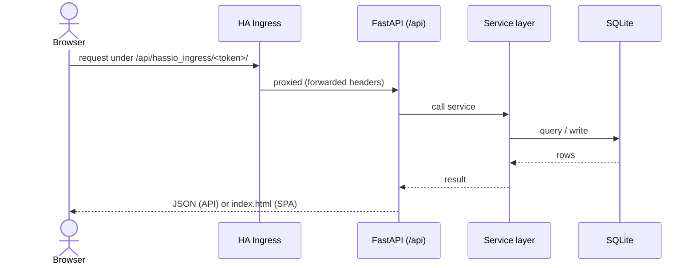
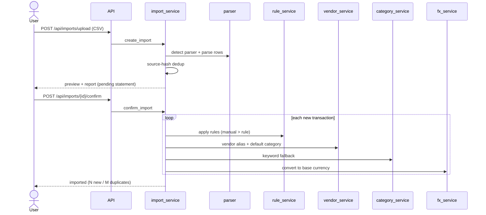
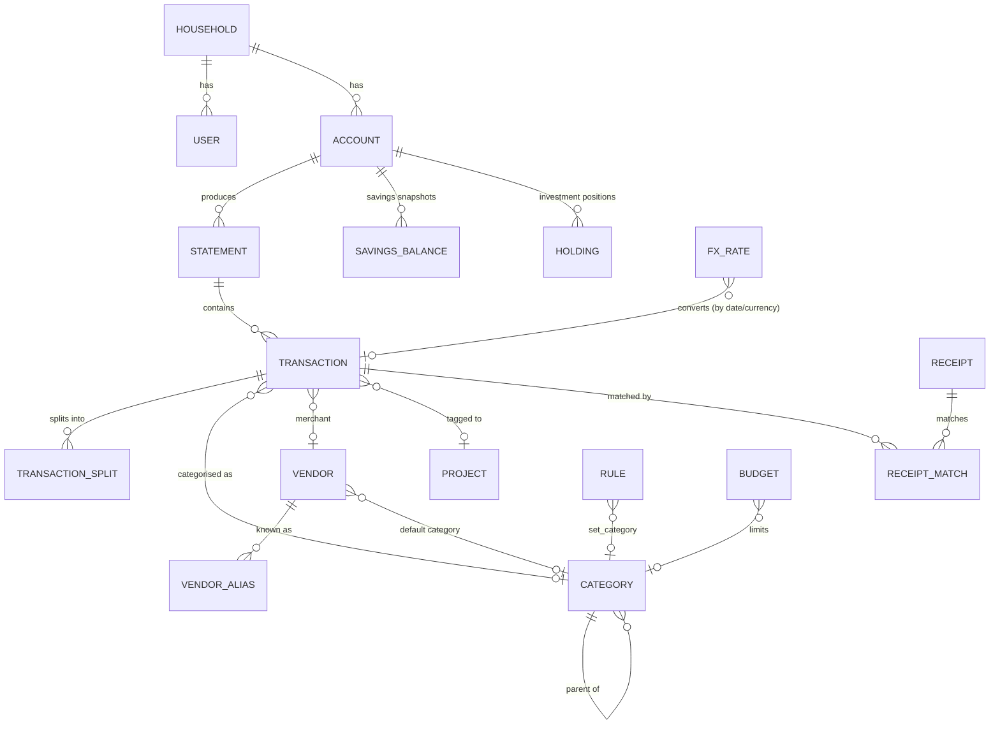
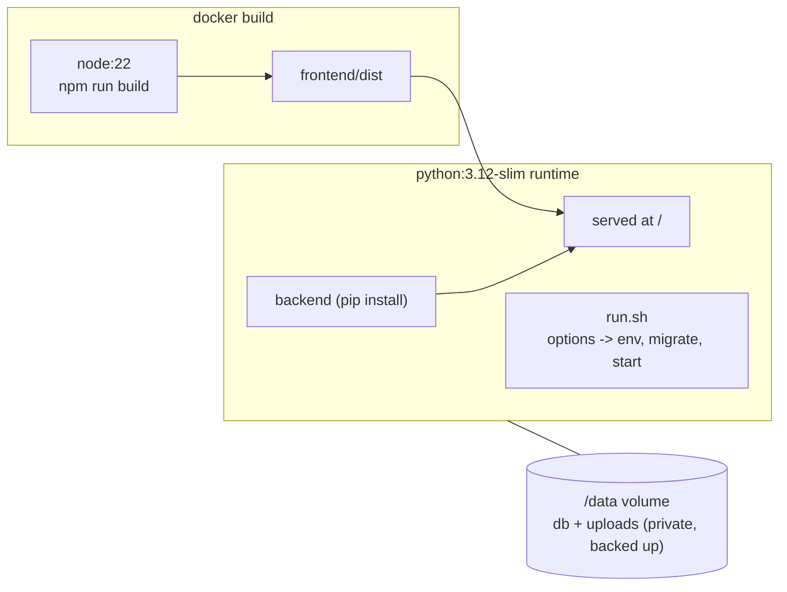

# Architecture diagrams

Visual companion to [`ha_finance_intelligence_spec.md`](../ha_finance_intelligence_spec.md)
and [`docs/context.md`](context.md). Backlog #94.

> **Prefer a browser?** [**architecture.html**](architecture.html) is a
> self-contained, styled version of these diagrams (inline SVG — renders offline,
> light/dark, no external scripts). This Markdown file keeps the same diagrams as
> [Mermaid](https://mermaid.js.org) so they render on GitHub and in VS Code.

Dashed = optional / opt-in / later stage.

## 1. System & infrastructure

> Standalone (no Home Assistant): the same container runs behind an optional
> TLS reverse proxy instead of HA ingress — see [reverse-proxy.md](reverse-proxy.md).

## 2. Request flow

## 3. Import & categorisation flow

## 4. Data model (core entities)

The full model has ~30 tables (spec §12); this shows the core relationships. Other
groups hang off the same `ACCOUNT`/`TRANSACTION`/`USER` spine: **savings**
(`SavingsBalance`, `SavingsGoal`), **investments** (`AccountValue`, `Holding`,
`HoldingPrice`), **assets** (`Asset`, `AssetLog` for cars/home), **receipts**
(`Receipt`, `ReceiptMatch`), **AI** (`AIRequest`), **review** (`ReviewItem`),
**subscriptions**, **rules**, **child allowance** (`ChildAllocation`), **MFA**
(`UserSession`) and **audit** (`AuditLog`). Retention adds an `archived_at` column
to transactions / receipts / AI-requests / audit-logs.

## 5. Deployment (add-on image)

## Keeping these current

Update a diagram when the corresponding shape changes (a new external
dependency, a new core entity, a changed flow). They are intentionally
high-level — the source of truth is the code and the spec.
