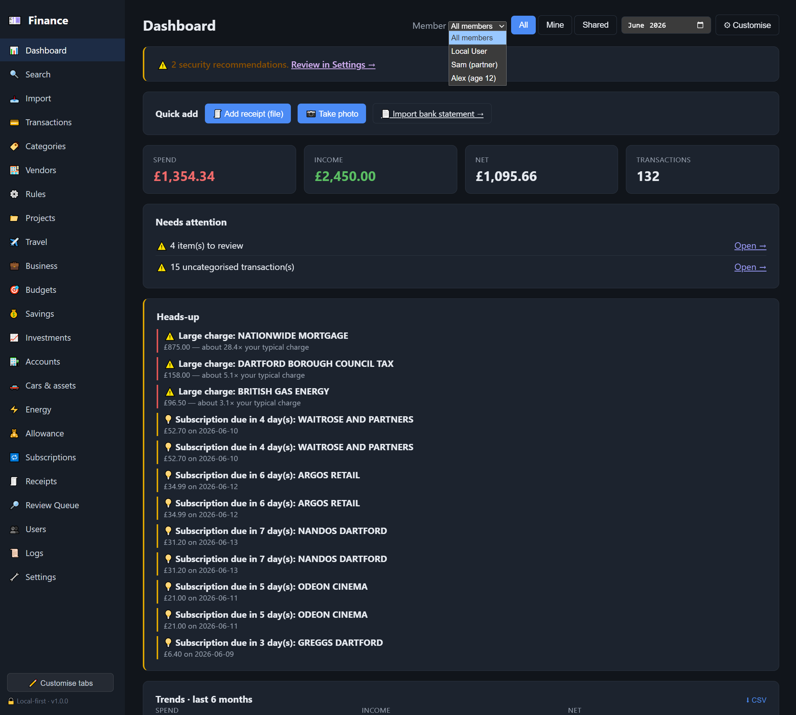
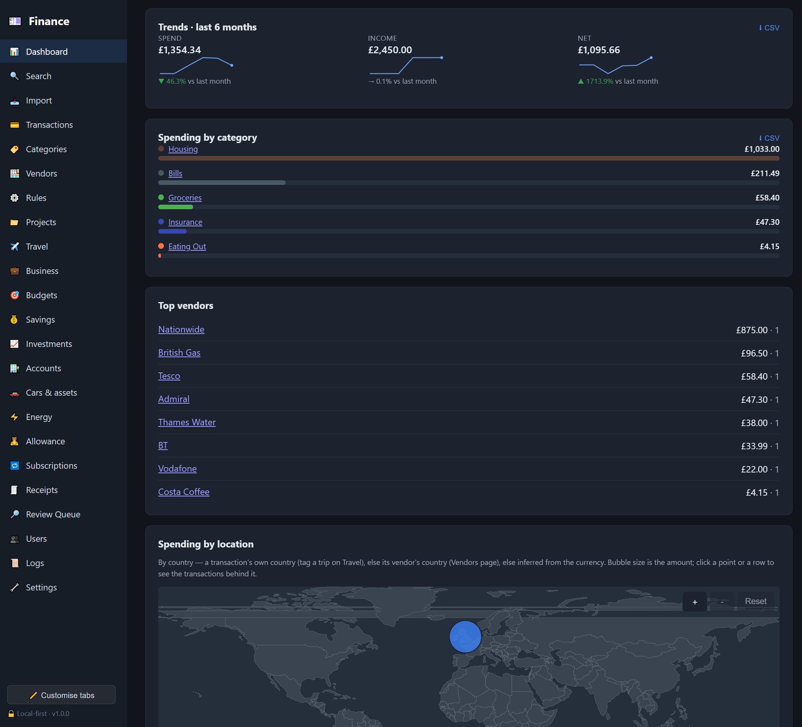
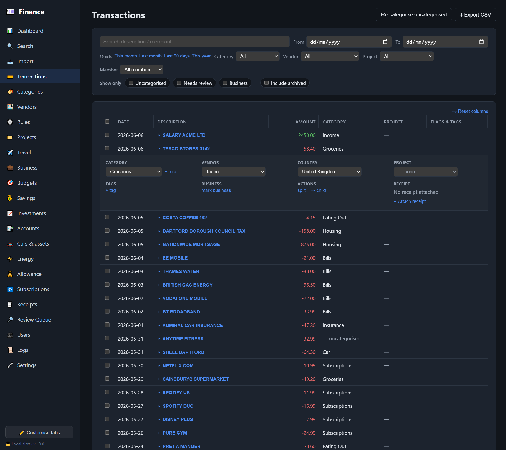
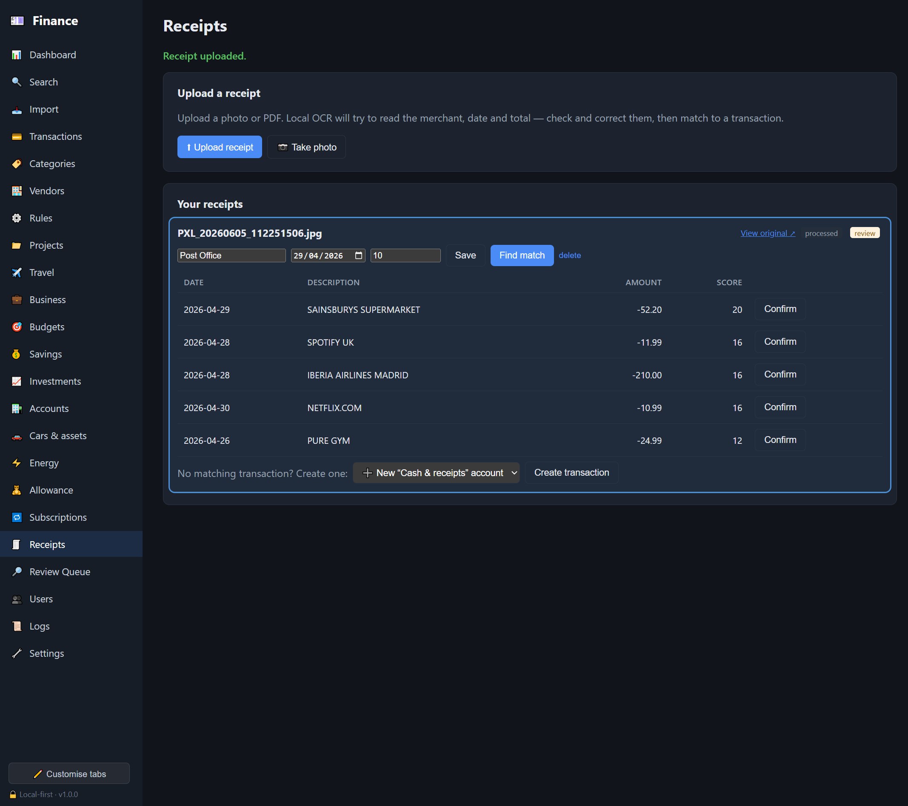
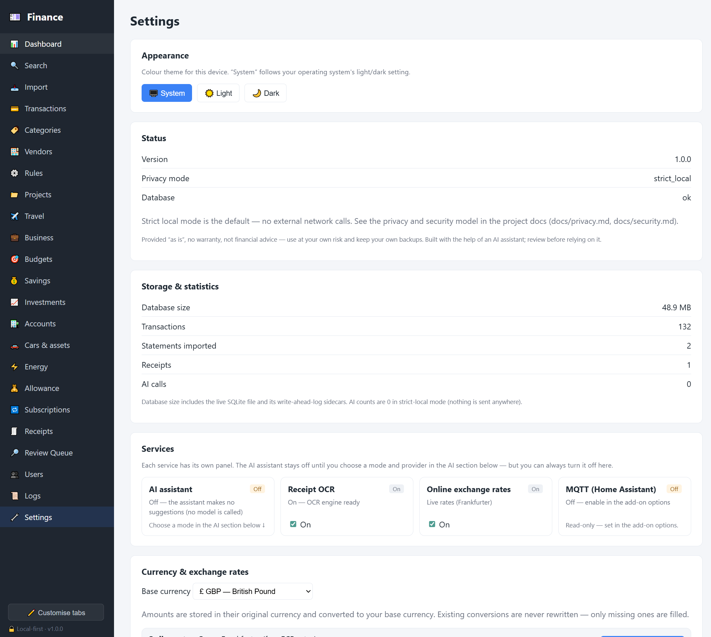
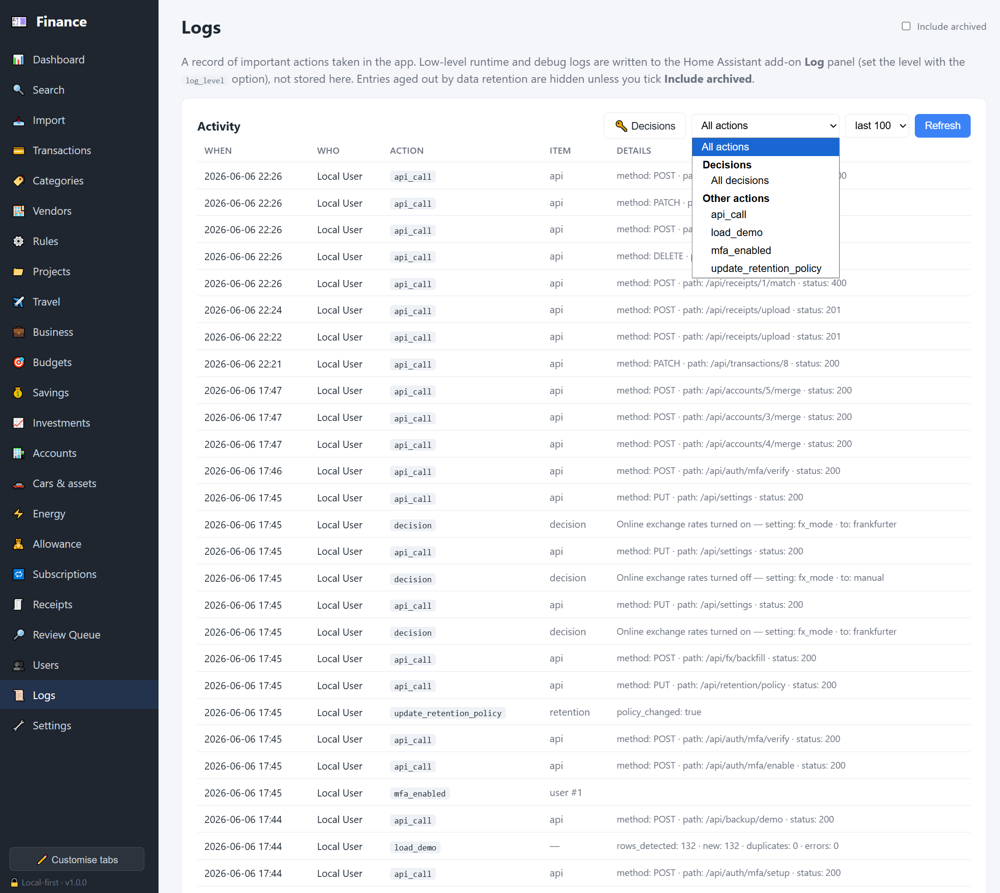

# Home Assistant community — intro post (draft)

> A ready-to-post draft for the [Home Assistant Community forum](https://community.home-assistant.io/)
> (Share your Projects! → Add-ons). Claude drafts; **you post**. Swap in your
> screenshots where marked, sanity-check the links, and adjust the tone to taste.
> Suggested category: **Add-ons**. Suggested tags: `addon`, `finance`, `local`, `privacy`, `mqtt`.

---

## Suggested title

**HA Finance Intelligence — a local-first personal-finance add-on (import statements, auto-categorise, budgets, receipts, MQTT sensors, energy-cost offset)**

---

## Post body

Hi all 👋

I've been building a **personal-finance add-on for Home Assistant** and it's now at a stable beta I'd love feedback on. The whole point is to understand household spending **without handing your bank data to a SaaS** — it runs entirely on your own HA, local-first.

### The problem it solves

Budgeting apps want a cloud account and your bank login. I wanted the opposite: drop in a CSV/PDF statement, get it categorised, see where the money goes, track budgets and receipts — and have **none of it leave the house**. Since it's an HA add-on, it also turns your finances into **entities** you can put on dashboards and automate against.

### Local-first & private by design

- **No external calls by default.** Strict-local mode is the default — zero outbound requests (no telemetry, no phone-home).
- Data lives in the add-on's **private `/data`** volume (SQLite), included in your HA backups.
- **AI is opt-in.** If you want auto-categorisation help you can point it at a **local LLM (Ollama/LM Studio)** so even that stays on your network, or a cloud model with redaction + per-request approval + a full audit log. Sensitive categories (salary, mortgage, medical…) are never sent.
- Sign-in is your **Home Assistant login** via ingress — no separate account.

### Key features

- 📥 **Import** bank statements — CSV (most reliable), PDF, or a **photo/scan** (OCR), with a review step.
- 🏷️ **Auto-categorise** with rules + a vendor library; one-click **✨ AI suggest** (category, country, and vendor) when you enable it.
- 📊 **Dashboard** — spending by category/vendor/member/project, a spend-by-location map, trends and budgets.
- 💸 **Budgets**, **subscriptions** detection, **savings/investments**, **car & home** running costs.
- 🧾 **Receipts** — upload/scan, auto-match to a transaction, or create a transaction straight from a receipt.
- 🏠 **MQTT sensors** — spend / income / net / budget / review-queue as HA entities for dashboards & automations.
- ⚡ **Energy-cost offset** — net your solar/grid production against your energy spend, right inside HA.
- 👨‍👩‍👧 **Multi-user** household with roles, plus a child/allowance view.

### Install (one-click repository add)

1. **Settings → Add-ons → Add-on store → ⋮ → Repositories** → paste the repo URL
   (or use the "Add to my Home Assistant" badge in the README).
2. **Install** (a prebuilt multi-arch image is pulled — no on-device compiling).
3. Open the Web UI from the sidebar — you're signed in as the owner automatically.

Repo + full docs: **<https://github.com/SpiritSLO-UK/HomeAssistant-expenses-analytics>**
(see `docs/ha-install.md` for the step-by-step, and `docs/privacy.md` for the privacy model).

### Status & feedback wanted

It's a **beta** — works end-to-end and I run it on my own HA on a Raspberry Pi 4. I'd really value feedback on:

- Import parsers for **your bank's** statement format (share an anonymised sample and I'll add a parser).
- The categorisation rules / vendor matching.
- Anything confusing in the setup or the privacy posture.
- **Local LLM (Ollama / LM Studio / HA LLM).** The `local_llm` mode is built but I **haven't been able to test it** — I don't have a local model set up. It targets any OpenAI-compatible endpoint and should work; if you run one, I'd love to hear what works (models, endpoint quirks, requirements) so I can harden that path.

Happy to answer anything. Thanks for taking a look! 🙏

---

## Screenshots

Captured on the built-in demo data (`Settings → Load demo data`). When posting to
the forum, **attach the image files** (drag them into the post) — the relative links
below render here on GitHub but won't resolve once pasted to the forum. Full set:
[docs/screenshots.md](screenshots.md).

**Dashboard** — monthly totals, a heads-up feed, trends, spending by category and a spend-by-location map:

**Transactions** — filter by anything, expand a row to categorise/split/tag it (with rules or ✨ AI):

**Receipts** — local OCR reads the merchant/date/total and matches to a transaction:

**Settings** — local-first by design: AI off by default, services panel, storage stats:

**Logs** — an audit trail with AI & privacy decisions grouped separately:

> Optional extras worth attaching: **Import**, **Budgets**, **Investments**, the
> **HA → Devices → MQTT** page (proves the integration), and the **Energy** offset
> card if you have solar. A short GIF of "drop a CSV → see it categorised on the
> dashboard" lands well too.
