# Screenshots

A tour of **HA Finance Intelligence**, captured on the built-in demo data
(`Settings → Demo data → Load demo data`). All amounts/names here are fabricated
demo data. AI is off in these shots - everything you see is processed locally.

## Dashboard

The dashboard is a stack of toggleable cards you can reorder. Top to bottom:

> Quick-add (receipt / photo / import), this month's **spend / income / net**, a
> per-member filter, items needing attention, and a **heads-up feed** - unusually
> large charges and upcoming subscription renewals.

> Six-month **trends**, **spending by category**, **top vendors**, and a
> **spend-by-location** map (every row and point drills through to its transactions).

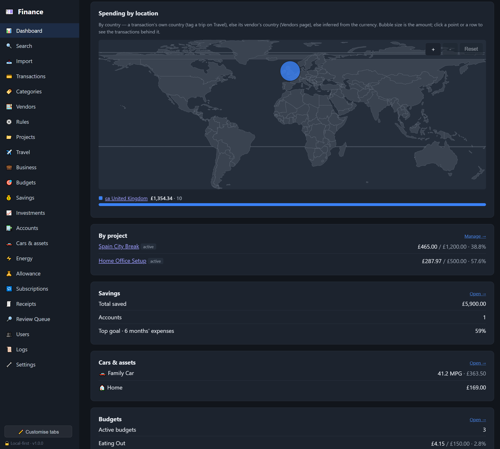

> Spend by location, **by project**, **savings** (total + goal progress) and
> **car / home** running costs.

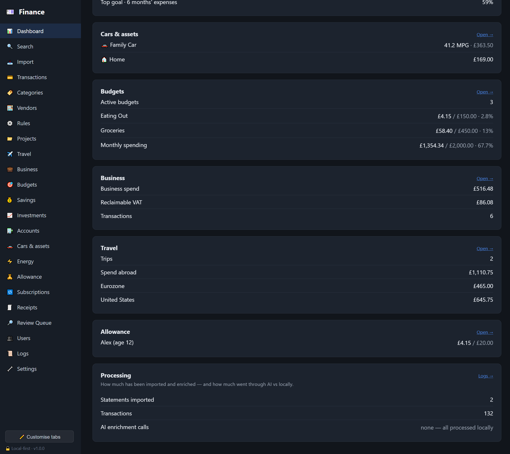

> **Budgets**, **business/VAT**, **travel** spend-abroad, **allowance**, and a
> **processing** summary - here showing every enrichment done locally, *no AI calls*.

## Transactions & import

> Filter by date, category, vendor, project, member or free text; expand any row to
> edit its **category** (with a rule or ✨ AI suggestion), **vendor**, **country**,
> **tags**, **business/VAT**, **splits**, and attach a **receipt**.

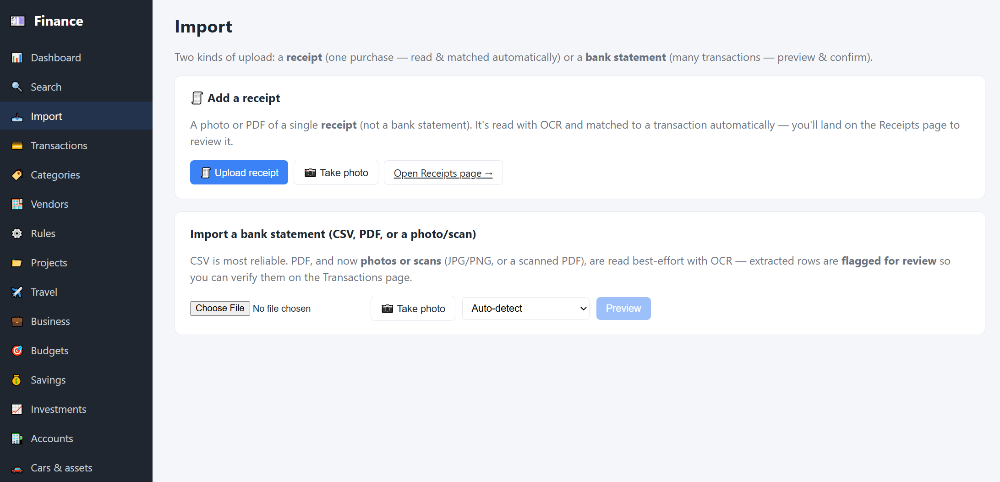

> Import a bank statement (**CSV / PDF / photo**) or upload a **receipt**. Imports go
> through a review step before anything is saved.

## Receipts

> Upload or photograph a receipt; **local OCR** reads the merchant, date and total,
> then matches it to a candidate transaction - or create a transaction straight from
> the receipt.

## Search

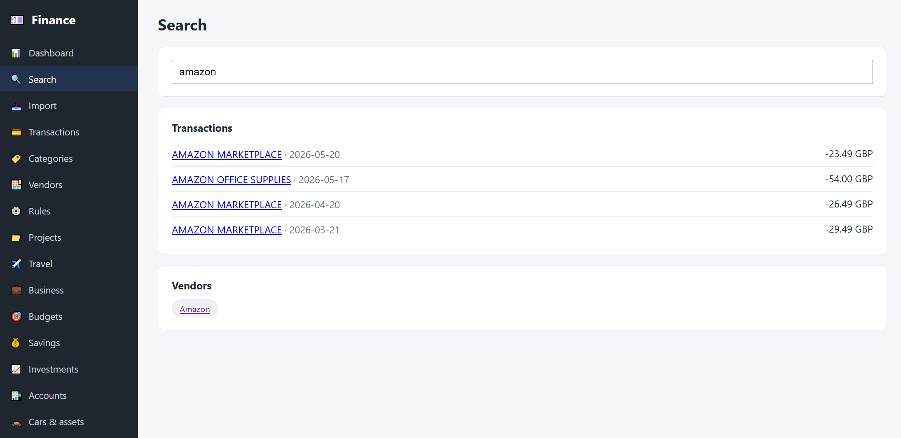

> One box searches transactions, vendors, categories and projects - instant even on
> very large datasets (backed by a full-text index).

## Budgets, investments & categories

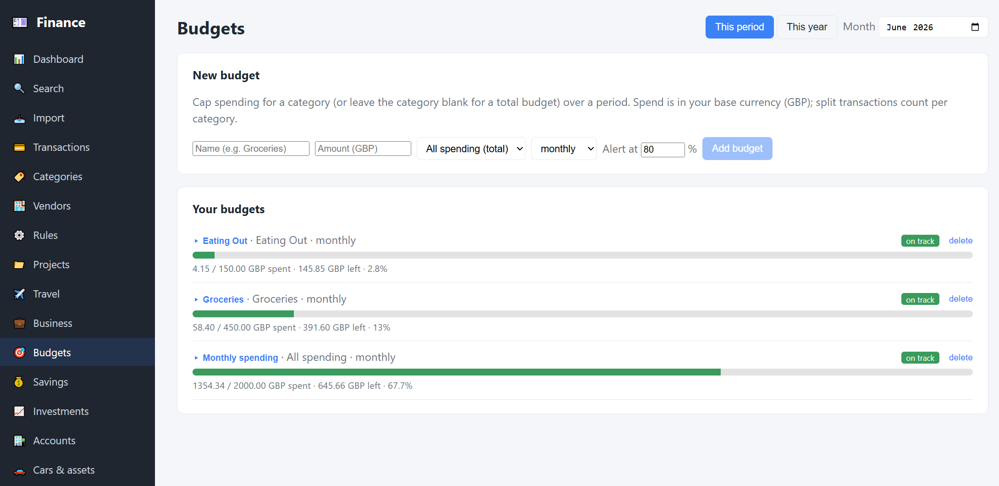

> Per-category **budgets** with progress, drill-down to the transactions behind each,
> and an annualised "this year" view.

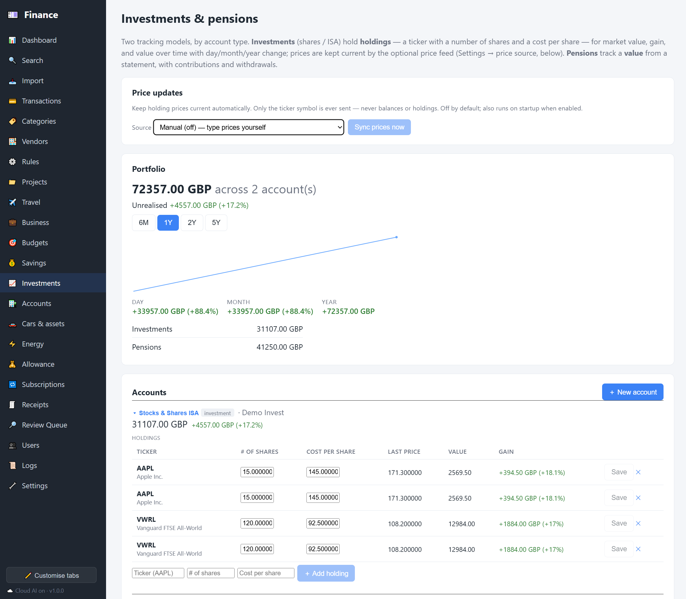

> **Investments & pensions** - holdings with market value and unrealised gain, plus
> **value-over-time** and day / month / year change.

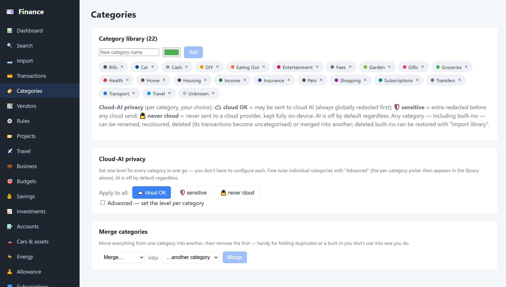

> Your **category library**, per-category **cloud-AI privacy** levels (cloud OK ·
> sensitive · never-cloud), and category **merge**.

## Settings (local-first & private)

> Theme, status, a **Storage & statistics** card (database size + AI-call tallies),
> and the **Services** panel - AI, receipt OCR, online exchange rates and MQTT.

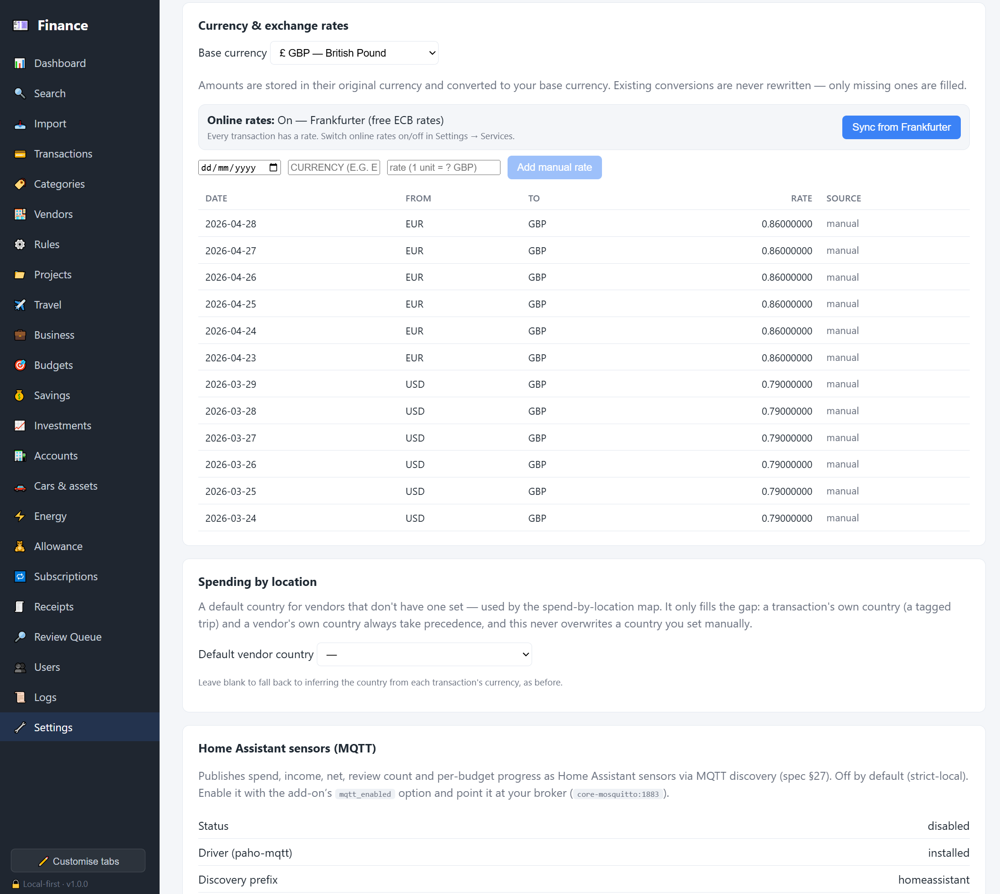

> Base currency and **exchange rates** (manual or online via Frankfurter), plus the
> spend-by-location default country.

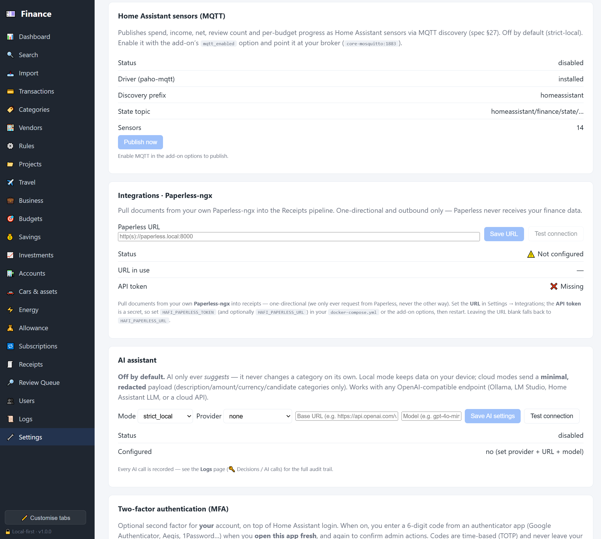

> **Home Assistant MQTT sensors**, optional **Paperless-ngx** import, and the **AI
> assistant** - off by default; works with any OpenAI-compatible (local or cloud) endpoint.

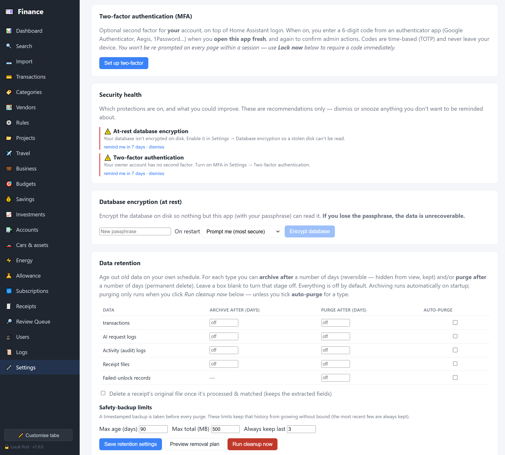

> **Two-factor (MFA)**, **security health** checks, **at-rest database encryption**,
> and **data retention** (archive / purge per type).

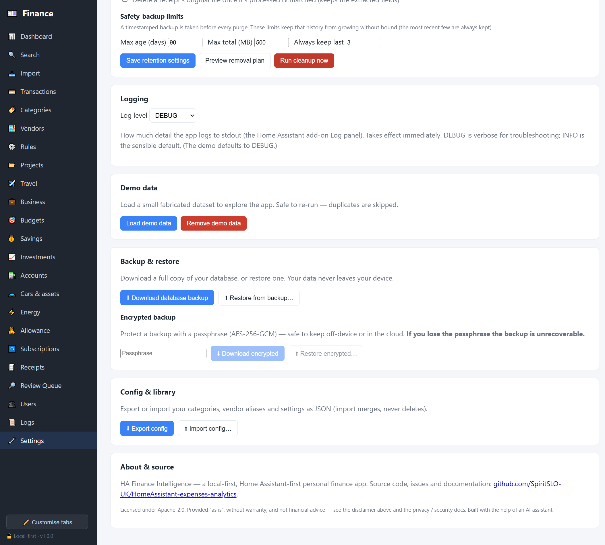

> Logging, demo data, **backup & restore** (including encrypted backups) and
> config/library export - your data never leaves the device.

## Logs (audit trail)

> A record of important actions, with **AI & privacy decisions** grouped separately
> from routine activity for a clear consent trail.

## Users & access

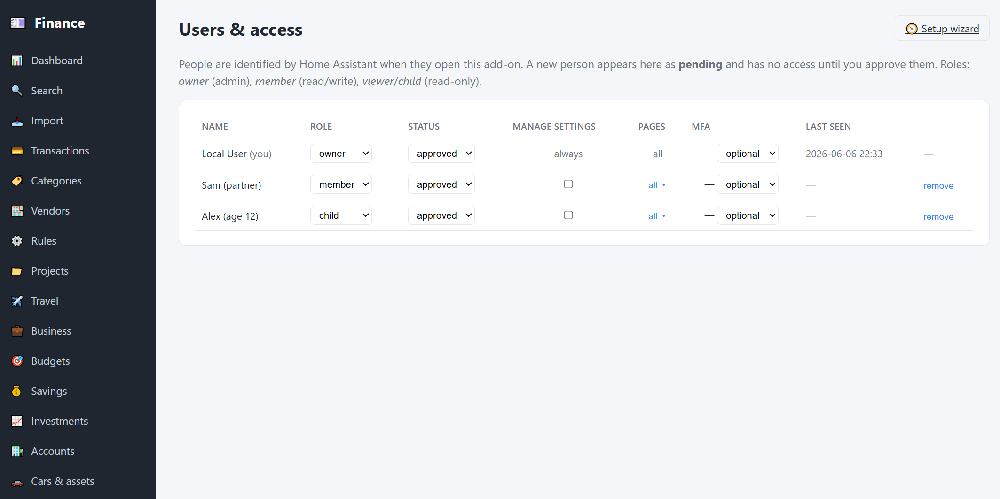

> A **multi-user household**: approve people, set roles (owner / member / viewer /
> child), restrict which pages each can reach, and require two-factor.
